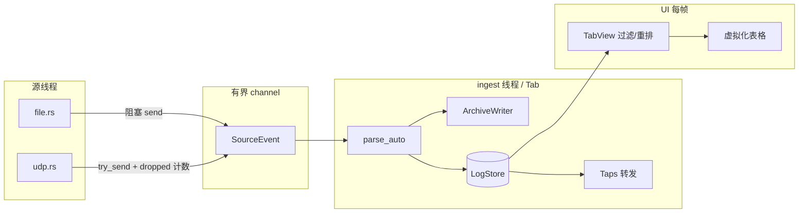

# Log Viewer 代码审查报告

> 审查日期：2026-06-22  
> 审查范围：`crates/lv-core`、`crates/lv-app`、CI、测试与 `docs/00-requirements.md` 需求对齐  
> 审查方式：静态代码阅读 + `cargo test --workspace` 验证

---

## 1. 执行摘要

`logviewer` 是一个结构清晰、目标明确的桌面日志查看器：核心库（`lv-core`）与 UI（`lv-app`）分层合理，数据流「源线程 → 有界 channel → ingest 线程 → `LogStore` → UI 每帧短锁读取」与需求文档一致。解析、过滤、搜索、归档、合并等 MVP 能力已基本落地，单元测试与端到端测试覆盖较好。

**总体评价：B+（可交付 MVP，仍有若干可靠性/一致性/可维护性改进点）**

| 维度 | 评分 | 说明 |
|------|------|------|
| 架构设计 | A- | 分层清晰，扩展点明确；部分注释与实现漂移 |
| 代码质量 | B | 生产路径大量 `lock().unwrap()`；`tab.rs` 职责过重 |
| 测试覆盖 | B+ | lv-core 105 单元 + 4 e2e；lv-app 仅 3 个测试；perf 默认 ignore |
| 需求对齐 | B+ | FR-S1~S3、FR-P1~P5、FR-4~11 基本满足；FR-S4/P6、按时长保留未实现 |
| 安全 | B | regex 线性引擎；UDP 默认 `0.0.0.0` 与需求 §7.4 表述有差距 |
| 可维护性 | B- | UI 单文件 1300+ 行；i18n/会话/仪表盘存在产品语义不一致 |

**验证结果（审查当日）**

```text
cargo test --workspace  → 112 passed, 2 ignored (perf), 0 failed
cargo build --workspace → OK
```

---

## 2. 项目概览

### 2.1 规模与结构

| 组件 | 职责 | 测试 |
|------|------|------|
| `lv-core` | 解析、输入源、存储、ingest、过滤/搜索/高亮/合并/导出/归档/统计 | 105 单元 + 4 e2e + 2 perf（ignore） |
| `lv-app` | egui 桌面 UI、标签页、虚拟化表格、仪表盘、i18n、会话 | 3 单元 |
| CI | ubuntu / windows / macos 三平台 build + test + release | `.github/workflows/ci.yml` |

Workspace 依赖管理集中（`Cargo.toml`），release 配置 `lto = thin`、`strip = true`，符合桌面分发预期。

### 2.2 数据流（核心设计）



**设计亮点**

- 核心库零 UI 依赖，符合 §8 可扩展性目标。
- UDP 背压：`try_send` + `AtomicU64 dropped`，不静默丢弃（`source/udp.rs`）。
- 存储：56B 定长 `RecordMeta` + 分块 Arena + 符号驻留，环形淘汰（行数/字节双限）。
- 乱序 UDP：存储保到达顺序；显示层 `TabView::sort_by_ts` 在尾部 8192 行窗口重排。
- 解析：`parse_auto` 按行首分派，失败回退 `ParsedLine::unparsed`，**绝不丢行**。

---

## 3. lv-core 审查

### 3.1 优势

1. **模块边界清晰**：`parse/`、`source/`、`store`、`ingest`、`view`、`filter`、`search` 等各自独立，公开 API 稳定。
2. **解析健壮**：RFC5424 / uf_log 模板 / RFC3164 / JSON 行 + 自动探测，混合格式逐行独立解析；恶意输入 e2e 覆盖（2MB 行、非法 UTF-8）。
3. **过滤/搜索性能意识**：`filter.eval_full` 用 rayon + `with_min_len(4096)`；meta 列扫描，仅在 msg 条件时触碰 Arena。
4. **归档设计合理**：独立于 UI 暂停；host 名 `sanitize`；轮转与保留份数可配；重开 append 不截断。

### 3.2 问题与风险

#### P0 — 可靠性

| 问题 | 位置 | 说明 |
|------|------|------|
| UDP 停止时尾批丢失 | `source/udp.rs:63-99` | `stop == true` 后直接退出，不足 64 行的 `batch` 未 flush，也未计入 `dropped` |
| Mutex 毒化 panic | `ingest.rs`、`tab.rs` 等 | 大量 `store.lock().unwrap()`；任一线程 panic 持锁会导致全局崩溃，与 §7.3「长跑不崩溃」有差距 |
| `IngestStats.errors` 无界 | `ingest.rs:40` | 持续 IO/归档错误时向量无限增长，长跑内存风险 |

#### P1 — 性能 / 正确性

| 问题 | 位置 | 说明 |
|------|------|------|
| 归档路径双重解析 | `ingest.rs:145-146, 172-173` | 启用归档时对每行 `parse_auto` 两次，UDP 高吞吐下 CPU 浪费 |
| taps 广播多份 clone | `ingest.rs:198-203` | 每个 tap `lines.clone()`，多合并 Tab 时内存/CPU 放大 |
| 合并快照重复解析 | `merge.rs:36-39` | 从 store 取 `raw` 再 `parse_auto`，而非复制已有 meta；ctx 不一致时结果可能偏离 |
| 文档漂移：`append_sorted` | `store.rs:3`、`merge.rs:3` | 注释提到 `append_sorted`，**代码中不存在**；实际乱序由 `TabView` 承担 |

#### P2 — 功能缺口

| 缺口 | 需求 | 说明 |
|------|------|------|
| 按时长保留 | FR-3 | `RetainLimits` 仅有 `max_rows` / `max_bytes` |
| TCP/SSH 等源 | FR-S4 | 未实现 |
| 自定义解析器插件 | FR-P6 | 无 registry API |
| 合并去重 | FR-8（可） | 未实现 |
| 过滤符号 live 刷新 | FR-4 | `CompiledFilter::refresh_syms` 需 UI 主动调用，core 无自动防护 |

#### P3 — 其它

- **UDP 默认 bind `0.0.0.0:514`**（`udp.rs`）：需求 §7.4 写「默认仅本机网段可达」，与实现/README 不一致。
- **文件源 `dropped` 永为 0**（`file.rs`）：`SourceHandle.dropped` 对文件源无意义，API 语义略混淆。
- **stats 时间范围估计**：仅扫描首尾各 1024 行（`stats.rs`），大乱序窗口下桶划分可能失真。
- **符号表双份 String**（`symbols.rs`）：map + list 各存一份，多 host 时内存偏高。

### 3.3 安全

| 项 | 状态 | 细节 |
|----|------|------|
| ReDoS | 较好 | `regex` crate 线性引擎 + `RegexBuilder::size_limit(1 << 22)` |
| 匹配超时 | 缺失 | 极长单行 + 复杂模式仍可能卡顿 UI |
| 路径注入 | 较好 | 归档 `sanitize` host 名 |
| 目录展开 | 边缘 | `expand_and_order` 无深度/symlink 循环防护 |
| UDP 暴露面 | 注意 | 默认监听所有接口；桌面工具常见，但与需求表述不符 |
| 日志内容执行 | 安全 | core 层无 shell/脚本执行路径 |

---

## 4. lv-app 审查

### 4.1 优势

1. **egui 模式成熟**：延迟动作队列（`Action` 帧末执行）、对话框状态机、虚拟化 `TableBuilder`、live 时 150ms 轮询重绘。
2. **与 core 分层清晰**：源/ingest/过滤/搜索/高亮/合并/导出均委托 lv-core；`fmt.rs` 只做显示层格式化。
3. **会话持久化**：`session.json` 恢复 Tab 类型、过滤、高亮、列配置等；Settings 有 legacy JSON 兼容测试。
4. **i18n 机制**：`Texts` 结构体 + `ZH`/`EN` 静态实例，编译期强制字段对齐（注释所述「漏译编译失败」在 struct 同步时成立）。

### 4.2 问题与风险

#### P0 — 产品语义不一致

| 问题 | 位置 | 说明 |
|------|------|------|
| **仪表盘统计基于全量 store，表格基于过滤视图** | `dashboard.rs:37-38` | 用户开过滤后，柱状图/Top/错误率与可见行不一致 |
| 合并 Tab 成员关闭无反馈 | `app.rs:416-421` | 成员 Tab 关闭后 taps 断开，合并 Tab 停止接收新数据，UI 无「部分离线」提示 |

#### P1 — UX / 会话

| 问题 | 位置 | 说明 |
|------|------|------|
| 会话保存不完整 | `session.rs` | 未持久化 `follow_tail`、搜索状态、`dash_threshold` per-tab 等 |
| 保存时机粗糙 | `app.rs:929-936` | 仅关窗 / Tab 数变化 / 30s 兜底；崩溃可能丢最近过滤/高亮改动 |
| 恢复失败静默 | `app.rs:255-257, 171-173` | 文件不存在或 UDP 绑定失败时 Tab 跳过，无 toast |
| 写盘错误静默 | `session.rs:73-80` | `let _ =` 忽略磁盘满/权限问题 |
| UDP 错误文案错位 | `app.rs:294, 641-642` | 端口无效却前缀「绑定失败」 |

#### P1 — 性能

| 问题 | 位置 | 说明 |
|------|------|------|
| 表格渲染长期持锁 | `tab.rs:653-915` | `table()` 全程 `store.lock().unwrap()`，ingest 写 store 被阻塞 |
| 合并 Tab 创建多锁 | `app.rs:372-385` | 同时锁多个成员 store + 目标 store，大 Tab 时 UI 可能冻结 |

#### P2 — i18n / 代码组织

- **硬编码字符串**：窗口标题（`main.rs`）、关于页、过滤快捷 `≥err`、仪表盘图例 `err+/warning`、级别名来自 core 英文常量等。
- **`tab.rs` 约 1300+ 行**：过滤 UI、搜索、表格、高亮编辑器、跳转、状态栏、速率采样全在一个 struct，维护成本高。
- **依赖版本**：`eframe/egui 0.34.3` + `egui_plot 0.35`，升级需注意 API 差异（CLAUDE.md 已警告）。

#### P2 — 合并 Tab 设计

- `TabKind::Merged { members: Vec<String> }` 存**标题**而非稳定 id；同名 Tab 语义模糊。
- `create_merged_tab` 直接操作 `ingest.taps`，与 core `Taps` 耦合，无封装。

---

## 5. 测试与 CI

### 5.1 现有覆盖

| 类别 | 数量 | 代表场景 |
|------|------|----------|
| lv-core 单元 | 105 | 各解析器、store 淘汰、filter 多维、view 乱序、archive 轮转、ingest taps |
| lv-core e2e | 4 | UDP→归档→重开、目录+.gz、合并快照+live、恶意输入 |
| lv-core perf | 2（ignore） | 百万行过滤/搜索/内存、UDP 50k/s |
| lv-app 单元 | 3 | Settings 反序列化、retain_limits、fmt delta |

### 5.2 缺口

- UDP 队列满时 `dropped` 计数与 batch 丢弃逻辑
- UDP shutdown 尾批 flush
- `max_file_secs` 归档轮转
- `CompiledFilter::refresh_syms` live 新 tag
- 合并快照 ctx 不一致回归
- 文件源 channel 背压（慢 ingest + 快读盘）
- lv-app Tab/会话 round-trip、过滤/搜索 UI 逻辑
- **CI 不跑 perf 测试**，§7.1 性能断言无自动化门禁

---

## 6. 需求对齐矩阵

对照 `docs/00-requirements.md`：

| 需求 | 状态 | 备注 |
|------|------|------|
| FR-S1 本地文件/.gz/目录 | ✅ | `source/file.rs` |
| FR-S2 UDP 多设备 | ✅ | 有界队列 + dropped 计数 |
| FR-S3 follow / tail -f | ✅ | 含轮转切换测试 |
| FR-S4 TCP/SSH 等 | ❌ | R3 范围外 |
| FR-P1~P4 多格式解析 | ✅ | `parse/*` + `detect.rs` |
| FR-P5 失败不丢行 | ✅ | `ParsedLine::unparsed` |
| FR-P6 自定义解析器 | ❌ | 无插件 API |
| FR-1/2 查看 | ✅ | core + lv-app |
| FR-3 存储+归档+保留 | ⚠️ | 行/字节 ✅；**按时长 ❌** |
| FR-4 过滤 | ✅ | 多维 + AND/OR + JSON 保存 |
| FR-5 显示 | ✅ | 列/密度/换行/时间模式 |
| FR-6 高亮 | ✅ | 规则包 JSON |
| FR-7 多 Tab | ✅ | 每 Tab 独立 store/ingest |
| FR-8 合并 | ✅ | 快照 + taps + 显示层重排；去重 ❌ |
| FR-9 仪表盘 | ⚠️ | 功能有；**与过滤视图不一致** |
| FR-10 搜索 | ✅ | 与过滤解耦 |
| FR-11 导出 | ✅ | text/json/csv |
| §7.1 百万行性能 | ⚠️ | perf 有断言但 CI ignore |
| §7.3 长跑稳定 | ⚠️ | 保留策略有；errors 向量、SymbolTable 只增需关注 |
| §7.4 安全 | ⚠️ | regex ✅；UDP bind ⚠️；无匹配超时 |
| §7.5 i18n | ⚠️ | 机制好；多处硬编码与级别英文名 |

---

## 7. 优先改进建议

按影响与投入比排序：

### 立即（1–2 天）

1. **修复 UDP shutdown 尾批丢失** — 退出前 flush `batch` 或计入 `dropped`。
2. **仪表盘与过滤视图对齐** — 传入 `view.seqs` 或在 UI 标明「全量统计」；产品需定夺。
3. **修正或删除 `append_sorted` 注释** — 统一乱序处理的设计叙述。

### 短期（1–2 周）

4. **ingest 归档复用 parse 结果** — 消除双倍 `parse_auto`。
5. **缩短 `table()` 持锁** — 先拷贝可见区 meta/文本再渲染。
6. **限制 `IngestStats.errors` 长度**；taps 改用 `Arc<[RawLine]>` 减少 clone。
7. **补 UDP 背压、shutdown flush、`max_file_secs` 单元测试**。
8. **合并 Tab 成员关闭时 UI 提示或自动断开**。
9. **会话持久化补全**（搜索、follow_tail、per-tab dash_threshold）+ 关键变更触发 save。

### 中期

10. **Mutex 毒化恢复**或换 `parking_lot` + 降级策略。
11. **拆分 `tab.rs`** 为 filter_panel / table / search 等子模块。
12. **CI 增加 release perf 子集**（或 nightly 跑 `--ignored`）。
13. **评估 UDP 默认 bind** 与需求 §7.4 一致性。
14. **i18n 补全** — 级别名映射、导出 toast、窗口标题随语言更新。

---

## 8. 结论

`logviewer` 在架构与核心能力上已达到可交付 MVP 水准：`lv-core` 设计扎实、测试充分，关键可靠性策略（UDP 背压计数、解析不丢行、环形保留、归档独立）与 PRD 高度一致。主要短板集中在 **UI 层产品语义一致性**（仪表盘 vs 过滤视图）、**并发锁粒度**（表格长期持锁）、**文档/注释漂移**、以及 **部分边界场景**（UDP 停止尾批、会话恢复失败静默）。

建议优先处理 §7 中「立即」与「短期」项，再考虑 FR-S4/P6 等扩展需求。

---

## 附录 A：审查方法

- 静态阅读：`lv-core` 全模块 + `lv-app` 8 个核心源文件 + CI + README + PRD
- 动态验证：`cargo test --workspace`（2026-06-22，Windows，112 passed / 2 ignored）
- 交叉引用：FR-* 编号与代码注释中的需求引用

## 附录 B：关键文件索引

| 主题 | 文件 |
|------|------|
| 数据流入口 | `crates/lv-core/src/source/mod.rs` |
| UDP 背压 | `crates/lv-core/src/source/udp.rs` |
| ingest 管线 | `crates/lv-core/src/ingest.rs` |
| 存储与淘汰 | `crates/lv-core/src/store.rs` |
| 乱序显示 | `crates/lv-core/src/view.rs` |
| 解析分派 | `crates/lv-core/src/parse/detect.rs` |
| 合并 | `crates/lv-core/src/merge.rs` |
| UI 主循环 | `crates/lv-app/src/app.rs` |
| Tab/表格 | `crates/lv-app/src/tab.rs` |
| 仪表盘 | `crates/lv-app/src/dashboard.rs` |
| 会话 | `crates/lv-app/src/session.rs` |
| E2E | `crates/lv-core/tests/e2e.rs` |
| 性能 | `crates/lv-core/tests/perf.rs` |
